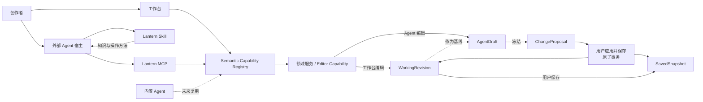
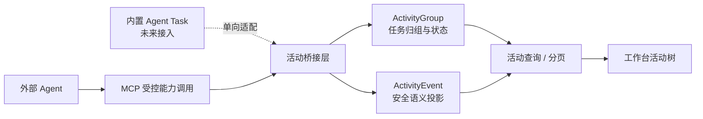

# Agent

Lantern 当前通过 MCP + Skill 与外部 Agent 协作。宿主 Agent 负责自然语言理解、规划、视觉分析、图片生成、记忆与任务编排；Lantern 负责漫画知识、作品上下文、受控编辑和版本审查。两者共同完成从理解作品到编排页面、检查结果和提交方案的创作闭环。

Agent 的目标不是远程操作工作台按钮，而是基于稳定作品语义完成可审计、可恢复的漫画创作。各项能力的当前接入事实见[漫画能力矩阵](./capabilities.md)，作品结构见 [LCD](./lcd.md)，工作台中的方案审查见[编辑器体验](./editor.md)。

> 内置 Agent 当前暂不迭代，其设计边界集中在本文最后说明。

## 1. Agent 能力总览

MCP + Skill 列表示外部 Agent 能否通过宿主、MCP、Skill 与 Lantern 审查界面形成对应协作结果；内置 Agent 列记录现有实验原型的覆盖情况：

- ✅ 已接入：可以形成可用结果并进入完整生命周期。
- 🟡 部分接入：已有基础链路，但范围或结果闭环尚不完整。
- ❌ 未接入：当前不能通过该列对应方式完成。
- ⚪ 不涉及：按该列的职责不承担；MCP 中通常由宿主 Agent 或用户完成。

| Agent 能力 | MCP + Skill | 内置 Agent |
|---|:---:|:---:|
| 读取漫画、一话、页面及角色、场景和视觉风格资产 | ✅ | 🟡 |
| 获取当前工作稿、Agent 草稿和最近保存版本的 LCD 与最终渲染画面 | ✅ | 🟡；仅当前工作稿 |
| 获取固定 AssetVersion 原图并理解单图、单格和整页构图 | ✅ | ❌ |
| 生成分镜图、角色图和场景图 | ⚪；由宿主生图能力提供 | ✅；仅单图 |
| 登记外部生成或用户上传的资产图、漫画封面和视觉风格图 | ✅ | ❌ |
| 创建和管理普通页、封面页、过场页与真正双页 | ✅ | ❌ |
| 创建画格并编辑边框、层级、阅读顺序和出血 | ✅ | ❌ |
| 放置、替换、移动、缩放、裁切和移除图片 | ✅ | ❌ |
| 创建和编排对白、气泡、旁白与纸面文字 | ✅ | ❌ |
| 普通破格、纸面叠加和有限跨页对象编排 | 🟡 | ❌ |
| 同源透明前景绑定真出格 | ✅；抠图由宿主完成 | ❌ |
| AgentDraft 连续编辑、ChangeProposal 冻结与整体审查入口 | ✅ | ⚪ |
| 单页构图与人物、场景、风格一致性检查 | ✅；只读 | ❌ |
| 相邻分镜连续性与创作表达检查 | ✅；只读 | ❌ |
| 漫画解析与可复用模板制作 | ❌ | ❌ |
| 多展示单元、多对象自动重排 | ❌ | ❌ |
| 选区、遮罩、局部重画和扩图 | ❌ | ❌ |
| 产品级多 Agent 或 Skill Workflow | ❌ | ❌ |

当前闭环以通用能力和页漫为主。外部 Agent 可以仅凭自然语言、Lantern 链接、MCP、Skill、自身生图能力或用户图片，完成接近示例漫画复杂度的页面；条漫专属编排、高级图片精修和自动化多 Agent 工作流不在当前能力内。

## 2. 整体设计与架构



工作台与 MCP 共享同一套语义 Capability；内置 Agent 只在图中保留未来复用关系。外部 Agent 不直接写 LCD、数据库或底层 WorkspaceCommand，也不能提交任意 ChangeSet。MCP 只开放已登记的语义 Capability；每项 Capability 由共享 schema 定义输入输出、适用对象、作用范围、风险、幂等规则、确认要求和版本前置条件。

领域操作产生四类结果：

| 效果 | 用途 | 结果 |
|---|---|---|
| `observe` | 读取结构、资源、渲染画面和状态 | Observation |
| `resource_mutation` | 上传并登记外部图片 | AssetVersion |
| `direct_change` | 确定、有界的页面、画格、图片和文字编辑 | ChangeSet |
| `candidate` | 生成式结构方案或需要预览的高风险结果 | Candidate |

### 2.1 对象定位与上下文

用户可以用自然语言、当前讨论范围中的名称、Lantern 本地 HTTP 链接或稳定的 Lantern 引用指出对象，不需要接触内部 ID。MCP 在有限作品范围内解析目标，并校验 owner、对象类型、所属一话和 revision。

一次可靠编辑同时使用：

- 当前漫画、一话、页面和相关资产的有限上下文；
- 同一 WorkingRevision、AgentDraft revision 或 SavedSnapshot 下的 LCD；
- 页面最终渲染画面和明确授权的固定资源原图；
- 绑定 revision 的对象 handle，防止过期观察写入错误目标。

外部 Agent 的对话、规划和记忆属于宿主。Lantern 只保存与作品相关的草稿 revision、变更、资源版本和冻结方案。宿主会话被取消、失败或删除不能破坏正式工作稿和保存版本。

### 2.2 编辑与方案生命周期

一话内容编辑先进入隔离 AgentDraft。任务中的多个 ChangeSet 可以连续执行，Candidate 被采用时也只合入该草稿，不逐项覆盖正式工作稿。完成后，Agent 冻结 ChangeProposal，并在回复末尾提供 Lantern 审查链接。

```text
WorkingRevision ──创建──> AgentDraft ──连续 ChangeSet──> AgentDraft revision
                                      └─ Candidate 合入
AgentDraft revision ──冻结──> ChangeProposal
ChangeProposal ──用户应用并保存──> 新 WorkingRevision + SavedSnapshot
               ├─保留方案
               └─丢弃方案
```

未经 Lantern 中可验证的用户动作，外部 Agent 不能应用或保存方案。若正式工作稿已经变化，用户仍可在对比界面查看冻结方案并确认覆盖风险；应用始终针对刚刚对比的当前 revision，原子创建新的 WorkingRevision 与 SavedSnapshot。正式版本保持线性，回到历史版本也通过复制其内容创建新版本。

删除页面、画格或图片等一话内容可以随 AgentDraft 整体审查。归档或删除漫画、一话和共享资产不属于单话草稿，必须先确认准确对象。

### 2.3 Agent 活动观察

Agent 活动是独立的只读审计投影，用于回答“Agent 对哪些对象做了什么”。它观察既有执行链路，不成为新的任务模型。



外部 Agent 无需遵循额外任务协议。MCP 根据作品范围、连续使用的 AgentDraft 和观察窗口归组活动，并通过幂等操作标识避免重复事件。内置 Agent 未来通过活动桥接单向记录既有 Task 的执行，不改变 Task 的状态、进度或交互。

#### 采集范围与展示

| 维度 | 规则 |
|---|---|
| 采集范围 | 记录 Agent 对作品的观察、资源操作和编辑；普通人工编辑不进入活动。 |
| 记录内容 | 记录能力、工具、动作、目标、结果状态、固定资源版本、时间、结果摘要和可选跳转目标。 |
| 图片资源 | 图片登记为 AssetVersion 后，随所属资源或草稿操作记录；临时上传过程不作为任务超时依据。 |
| 敏感数据 | 不保存 Prompt、完整 MCP 参数、密钥、令牌、对象键或签名 URL；详情只展示经过过滤和限长的安全语义字段。 |
| 作品与版本 | 活动不进入 LCD、WorkingRevision、SavedSnapshot 或版本列表；方案应用后仅关联由此形成的正式 SavedSnapshot。 |
| 展示形式 | 活动按任务分组，组内以事件列表展示；用户可以展开详情或跳转到关联页面、图片、方案和版本，但不能在活动面板中编辑、重试、应用或删除。 |
| 使用边界 | 活动记录只用于审计观察，不进入 Agent 的规划上下文。 |

#### 状态变化

| 触发条件 | 活动状态 | 对创作事实的影响 |
|---|---|---|
| 首次可归属的页面观察或 MCP 操作 | 运行中 | 建立或续接 ActivityGroup。 |
| 30 分钟内出现后续 MCP 活动 | 运行中 | 续期观察窗口。 |
| 观察窗口到期且没有新活动 | 已超时 | 仅表示 Lantern 无法确认宿主仍在执行；不取消或改写 AgentDraft。 |
| 超时后再次出现 MCP 活动 | 运行中 | 恢复观察，不创建新的任务语义。 |
| AgentDraft 冻结为 ChangeProposal | 待确认 | 关联冻结方案和审查入口。 |
| 用户应用方案并保存 | 已完成 | 关联该次原子创建的正式 SavedSnapshot。 |

单次 MCP 操作失败只保留原失败事件，不能据此推断任务失败；观察窗口到期时，系统追加超时事件。活动只记录 Lantern 已观察到的事实，不把外部宿主不可见的中断推断为新的任务状态。

## 3. MCP

MCP 是 Lantern 对外提供作品上下文和执行能力的传输层，负责：

- 建立本地身份、owner 和作品访问边界；
- 解析自然语言范围、Lantern 链接和稳定引用；
- 查询漫画、一话、页面、资产、revision 和渲染画面；
- 返回固定 AssetVersion 的原图和稳定映射；
- 暴露经过筛选的语义 Capability；
- 登记外部生成或用户提供的图片；
- 创建并推进 AgentDraft，冻结 ChangeProposal 和审查链接；
- 返回结构化结果、幂等结果、冲突和确认要求。

MCP 不代理图片生成 Provider。宿主 Agent 自行生成图片，或使用用户提供的图片，再由 MCP 登记为不可变 AssetVersion。普通画格成图默认只登记为作品使用的固定图片版本；只有用户要求沉淀，或图片确实属于角色、场景、道具、视觉风格等长期上下文时，才加入资产空间。

真出格也遵守这一边界。宿主 Agent 从格内源图的固定版本制作透明 PNG 或无损 WebP：输出必须与源图像素尺寸、画布原点和色彩空间一致，只把非主体区域设为透明，不能重新生成主体或裁紧画布。MCP 登记该固定结果后，通过语义能力把它作为源图的透明前景投影；领域 Capability 校验格式、尺寸、来源关系和 revision，并使源图的取景与局部变换持续驱动前景。Lantern 不执行抠图，也不把两个无关对象依靠坐标约定伪装成绑定关系。

MCP 也不复制工作台状态。画布导航、选择、悬停、工具条、虚拟补位和 Undo 游标不投影为工具；Agent 只读取完成任务所需的作品事实，并通过语义能力得到同等领域结果。

### 3.1 MCP 扩展原则

新增 MCP 能力先明确作品语义，再决定传输形式。面向创作的工具进入统一 Capability 目录，共享输入输出、权限、风险、幂等和版本前置条件；MCP 不直接暴露底层服务或数据写入，也不另建一套执行路径。

所有 MCP 工具经过同一装配边界，使能力登记、权限控制和活动观察保持一致。工具是否形成活动遵循 2.3 的审计范围；活动只使用稳定的领域语义和最小结果投影，不能改变 AgentDraft、WorkingRevision 或 SavedSnapshot 的生命周期。

## 4. Skill

Lantern 分发一个应用级入口 Skill。Skill 不复制 MCP schema 或完整工具目录，而是让宿主 Agent 理解作品、选择正确能力并遵守漫画创作约束。

Skill 主要提供四类知识：

1. **作品语义**：Comic、Chapter、Project、PresentationUnit、PageSurface、Frame、Overlay、Dialogue 与 AssetVersion 的关系。
2. **编排知识**：页漫坐标、格间距、阅读顺序、安全区、出血、普通破格、绑定真出格、跨页、中缝、留白、气泡避让和视觉引导。
3. **创作契约**：根据用户目标处理一话、一页、数页或局部重编排；图片按画格分别生成和放置，不默认生成包含多个漫画格的合成图。
4. **检查方法**：联合 LCD、最终合成画面、固定原图、角色与场景资产、故事和视觉风格设定，分析构图、一致性、分镜连续性和创作表达。

Skill 帮助 Agent 在局部修改时先观察整页关系，必要时联动调整相邻画格，避免只放大目标格而破坏安全区、格间距或整体阅读节奏。它也指导 Agent 区分临时成图与长期资产、区分 WorkingRevision 与 SavedSnapshot，并在任务完成后明确返回方案审查链接。

所有视觉和叙事检查保持只读。Skill 可以定义检查步骤和输出结构，但不能自行扩大 MCP 权限、绕过版本校验或把分析结果直接写回作品。服务端也不能假设宿主一定正确读取或执行了 Skill，安全约束仍由 MCP 与领域层保证。

## 5. 内置 Agent

内置 Agent 是由 Lantern 管理运行时、上下文与交互的工作台原生协作方式。它与工作台和 MCP 复用同一套作品事实与 Capability，但采用更稳定、收敛的产品交互。

### 5.1 产品形态与运行方式

内置 Agent 面向工作台内持续、收敛的创作协作。Lantern 管理模型、对话、规划、任务状态、候选结果和用户交互，并可以天然获得当前作品、页面、选择和创作焦点。它不要求用户安装外部宿主，也不把 Prompt、工具选择或运行过程暴露成需要维护的产品对象。

| 设计维度 | 内置 Agent |
|---|---|
| 理解与规划 | Lantern 管理主 Agent、上下文、任务和结果交互 |
| 上下文 | 获得当前作品、页面、选择、候选和任务上下文 |
| 漫画知识 | 作为产品规则、规划上下文和专门检查职责的一部分 |
| 图片来源 | 使用 Lantern 明确接入的生成与资产链路 |
| 产品形态 | 交互稳定、能力收敛，不要求用户理解内部工具 |
| 执行与安全 | 与 UI、MCP 共用 Capability、确认和版本边界 |

内置 Agent 可以比外部 Agent 更直接地理解工作台焦点，但这种便利不能成为额外写入权限。它仍应通过 Semantic Capability Registry 使用 LCD、AssetVersion 和版本校验，不建立第二套工具契约、对象 ID 或作品写入路径。

### 5.2 上下文、任务与结果

一次内置 Agent 行动由 Lantern 固定当前作品范围、选择对象、引用资源和基准 revision。对话负责表达意图，Task 负责异步运行状态，Candidate 负责承载尚未进入工作稿的生成或结构结果；三者具有独立生命周期。

```text
用户意图 + 当前工作台上下文
  → 内置 Agent 规划
  → 已登记 Capability
  → Observation / ChangeSet / Task
  → Candidate
  → 用户应用
  → WorkingRevision
```

- 只读理解返回 Observation，不产生作品修改。
- 确定、有界、低风险且可撤销的编辑可以形成 ChangeSet。
- 图片生成、结构调整、多对象操作和其他高风险结果先形成 Candidate。
- Candidate 固定来源 Task、目标对象和基准 revision，应用前必须检查过期与冲突。
- 取消、失败、重试或删除对话不能破坏已经应用的工作稿和保存版本。
- 用户应用结果后仍通过统一 WorkingRevision、Undo / Redo 和保存快照继续管理。

内置 Agent 的 Candidate 适合单次结果或少量明确对象。整页、整话或长时间连续创作应复用 AgentDraft 与 ChangeProposal 的整体审查方式，而不是让多个 Candidate 静默覆盖工作稿。

### 5.3 多 Agent 与 Workflow

内置 Agent 可以由一个面向用户的主 Agent 协调多个专门职责。多 Agent 与 Workflow 只是统一 Capability 之上的规划层，不是新的作品写入通道。

| 创作职责 | 主要关注 | 产物 |
|---|---|---|
| 编排与作画 | 页面结构、画格、图片、对白和创作执行 | ChangeSet、Candidate、AssetVersion |
| 视觉一致性检查 | 人物、服装、场景、色彩、光线和空间关系 | Observation、修改建议 |
| 分镜与表达分析 | 叙事连续性、节奏、视线、镜头和情绪表达 | 分析结果、分镜候选 |
| 漫画解析与模板制作 | 跨页规律、版式、留白、文字布局和风格特征 | 模板草案、模板 Candidate |

主 Agent 负责划定子任务上下文和可用 Capability、汇总结果、处理冲突并决定何时请求用户确认。子 Agent 只能看到职责需要的最小上下文，不能直接写 LCD，也不能通过分工绕过对象归属、版本冲突、Candidate 或用户确认。

一致性检查与分镜分析应保持可独立运行：前者判断作品事实是否稳定，后者判断叙事和创作表达是否成立。漫画解析与局部图片精修也属于不同方向：解析用于提取可复用规则，选区、遮罩、重画和扩图则产出新的图片版本或候选。
