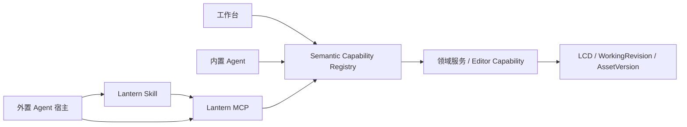

# Agent

Lantern 同时支持产品内的内置 Agent，以及通过 MCP 与 Skill 接入的外置 Agent。两者复用同一套语义 Capability、作品协议和安全边界，但不共享运行时：内置 Agent 由 Lantern 负责上下文、规划和结果交互；外置 Agent 由宿主负责理解、规划、记忆与协作，Lantern 只提供领域知识、作品上下文和可执行能力。

Agent 的目标不是复制工作台按钮，而是用自然语言完成可审计、可撤销的漫画创作操作。当前两种入口都只覆盖基础能力，尤其页面布局、画格、图片编排、裁切和气泡仍未形成完整闭环。

本文只定义 Agent 架构与能力边界；各入口的当前事实见[漫画能力矩阵](./capabilities.md)，作品结构见 [LCD](./lcd.md)，工作台中的对话与候选呈现见[编辑器体验](./editor.md)。

## 1. Agent 能力总览

状态仅表示 **Agent 入口当前能否独立完成该项能力**，不是整个产品的能力状态：

- ✅ 已接入：可形成可用结果并进入对应生命周期。
- 🟡 部分接入：已有基础链路，但语义、编辑或结果闭环不完整。
- ❌ 未接入：尚不能通过该 Agent 入口完成。

| Agent 能力 | 内置 Agent | 外置 Agent（MCP + Skill） |
|---|---:|---:|
| 读取作品、章节、页面及角色/场景/风格资产 | 🟡 | 🟡 |
| 获取当前页面结构与最终渲染画面 | ✅ | ✅ |
| 理解单图、单格和整页构图 | ❌ | ❌ |
| 生成分镜图、角色图和场景图 | ✅ | ❌ |
| 登记外部生成或用户上传的图片 | ❌ | ✅ |
| 创建与管理普通页、封面页、特殊页和双页 | ❌ | ❌ |
| 创建画格并编辑边框、层级与阅读顺序 | ❌ | ❌ |
| 放置、替换、移动、缩放、裁切和移除图片 | ❌ | ❌ |
| 创建与编排对白、气泡、旁白和文字 | ❌ | ❌ |
| 出血、破格、纸面叠加和跨页对象编排 | ❌ | ❌ |
| 多格、整页和多对象生成或重排 | ❌ | ❌ |
| Task、Candidate、Apply 与撤销闭环 | 🟡 | 🟡 |
| 选区、遮罩、局部重画和扩图 | ❌ | ❌ |
| 人物、场景、风格与画面连续性检查 | ❌ | ❌ |
| 跨页漫画解析与可复用模板制作 | ❌ | 🟡 |
| 多 Agent / Workflow / Skill Workflow 协作 | ❌ | 🟡 |

其中，外置 Agent 的“部分接入”不等于只读定位：当前已有部分读取、资源管理、图片登记和 Candidate 读取/Apply，但还不能调用具体页面编辑能力，预期继续补齐 Agent 适用的创作结果。漫画解析目前只能依靠 Skill 形成理解或草案，尚未具备跨页解析与稳定模板对象；外置协作目前也主要依赖宿主 Agent 与知识型或只读检查 Skill，并非 Lantern 内的 Workflow 产品能力。

## 2. 双入口架构

| 设计维度 | 内置 Agent | 外置 Agent |
|---|---|---|
| 理解与规划 | Lantern 管理主 Agent、后续子 Agent 和 Workflow | Codex 等宿主 Agent 管理，可自由组合其他 Agent |
| 上下文 | 可天然获得当前作品、页面、选择和任务上下文 | 通过 MCP 读取有边界、带版本的上下文 |
| 漫画知识 | 作为产品规则和内置规划的一部分 | 由 Lantern Skill 补充 LCD、编排规范和能力用法 |
| 图片来源 | 使用 Lantern 已接入的生成与资产链路 | 使用宿主自己的生图能力，或登记用户提供的图片 |
| 产品形态 | 更稳定、收敛，交互由 Lantern 控制 | 更自由，语言交互、记忆和协作方式由宿主控制 |
| 执行与安全 | 统一经过 Capability、确认、Candidate 和版本校验 | 同左，不因宿主或 Skill 获得额外权限 |

两种入口追求的是相同的领域结果和作品边界，不要求使用相同模型、Prompt、编排过程或交互界面。

## 3. Capability 与写入边界

UI、内置 Agent 和 MCP 只调用已登记的语义 Capability。每项 Capability 以共享 schema 为唯一事实源，至少声明：

- 稳定 ID、版本、输入输出 schema 和适用对象；
- 所需上下文、执行方式、作用范围和幂等规则；
- 对内置 Agent、外置 Agent 的可见性；
- 风险等级、确认要求、撤销能力和版本前置条件。

Agent 不得直接写 LCD、数据库、底层 WorkspaceCommand，也不能提交任意 ChangeSet。领域层根据操作语义产生以下结果：

| 效果 | 典型用途 | 结果 |
|---|---|---|
| `observe` | 读取结构、资源、渲染画面和状态 | Observation |
| `resource_mutation` | 上传并登记外部图片 | AssetVersion |
| `direct_change` | 确定、低风险且可撤销的编辑 | ChangeSet |
| `candidate` | 生成、结构、多对象或高风险结果 | Candidate |

外置 Agent 可以在同一轮请求中继续 Apply，不要求用户回到工作台；这不取消内部的 Candidate、版本校验和 Apply 机制。删除整页、整话、整部作品等大范围破坏性操作必须获得明确确认。直接修改进入普通撤销历史，外置 Agent 不控制工作台的撤销游标。

## 4. 上下文与结果生命周期

用户可以通过自然语言、局部范围中的名称、复制的 Lantern 本地 HTTP 链接或稳定的 Lantern 引用指出对象，不需要理解内部 ID。MCP 将这些输入解析为稳定引用，并在执行前校验归属、类型和版本。

一次可靠编辑至少依赖：

- 当前作品、章节、页面和相关资产的有界上下文；
- 同一 WorkingRevision 下的结构数据与最终渲染画面；
- 绑定修订版本的对象 handle，防止基于过期观察写入；
- Capability 返回的 ChangeSet、Candidate、AssetVersion 或 Observation。

内置 Agent 的对话、任务和候选由 Lantern 管理；外置 Agent 的对话、规划和记忆属于宿主，Lantern 只保存与作品相关的任务、候选、变更和资源事实。会话取消、失败或删除不能破坏已经确认的作品内容。

## 5. 协作编排模型

多 Agent 与 Workflow 是对单一 Capability 层的上层编排，不是新的作品写入通道。内置与外置的对应关系如下：

| 创作职责 | 内置 Agent 的扩展方式 | 外置 Agent 的对应方式 | 主要产物 |
|---|---|---|---|
| 页面编排与作画 | 主 Agent 委派编排或作画子 Agent | 宿主 Agent 调用编排 Skill 与 MCP | ChangeSet、Candidate、AssetVersion |
| 视觉连续性检查 | 只读检查子 Agent | 一致性检查 Skill 或专门 Agent | Observation、修改建议 |
| 分镜连续性与创作表达 | 分镜分析子 Agent | 分镜分析 Skill Workflow | 分析结果、分镜候选 |
| 漫画解析与模板制作 | 解析和模板 Workflow | 解析 Skill Workflow | 模板草案或后续模板 Candidate |

主编排者负责限制子任务上下文和可用 Capability、汇总冲突结果，并决定何时请求用户确认。子 Agent、Skill 和 Workflow 复用同一身份、对象引用、版本校验和风险边界，不能通过分工绕过权限。

协作模型包含四类可独立组合的职责：

- 编排与作画负责产生创作结果；
- 一致性检查关注人物、场景、服装、色彩和空间关系；
- 分镜分析关注叙事连续性、节奏、视线和创作表达；
- 漫画解析从单页理解扩展到跨页分析，并提取可复用的风格、版式、留白、节奏和文字布局。

漫画解析与局部图片精修是两条独立能力：前者产出模板草案，后者通过选区、遮罩、重画或扩图产出新的 AssetVersion 或 Candidate。对某一作品做连续性校准，也不自动形成可复用模板。

## 6. MCP 与 Skill

MCP 是外置 Agent 的能力传输层，负责：

- 建立本地身份与访问边界；
- 解析自然语言、链接和稳定引用；
- 查询作品、页面、资产、修订和渲染画面；
- 暴露经过筛选的 Capability；
- 登记外部生成或用户上传的图片；
- 返回结构化结果、错误、版本冲突和确认要求。

外置图片生成完全由宿主 Agent 或用户负责。Lantern MCP 不代理内部生图 Provider，只接收结果、写入不可变 AssetVersion，再通过 Capability 放置、替换或裁切。

Lantern 分发一个应用级入口 Skill，内部按领域参考和 Skill Workflow 组织知识，避免多个 Lantern Skill 竞争触发。宿主仍可以把它与自己的其他 Skill 或专门 Agent 组合。入口 Skill 用于帮助外置 Agent：

- 理解 LCD、页面结构、坐标、画格、图片、气泡和 Candidate；
- 组合结构观察、最终渲染、角色/场景/风格资产来维持一致性；
- 遵守出血格、破格、装订线、安全区、跨页对象、阅读顺序和气泡避让等漫画规范；
- 判断何时直接修改、何时产生 Candidate、何时必须确认；
- 组织单页构图检查、一致性检查、分镜分析和漫画解析等 Skill Workflow。

Skill 只定义知识和操作方法，不复制 MCP schema、完整工具目录或 UI 步骤，也不承担服务端权限校验。服务端不能相信 Skill 一定被读取或正确执行。

## 7. 外置 Agent 的基础创作范围

### 7.1 定位与能力范围

基础范围只包含通用能力和页漫专属能力，不包含条漫的滚动节奏、视口切分和跨段连续性。目标是让 Codex 等外置 Agent 仅凭自然语言、Lantern 链接、MCP、Skill、自身生图能力或用户图片，完成接近示例漫画复杂度的页面；示例漫画只是能力水平参考，不是固定任务、模板或 Workflow。

基础闭环包括：

- 创建和管理普通页、封面页、章节间页等特殊页，以及真双页；
- 创建画格，设置边框、层级、阅读顺序、出血和有限破格；
- 在画格或纸面放置图片，并完成替换、移动、缩放、裁切和移除；
- 创建与编排对白、气泡、旁白和基础文字；
- 支持有限的纸面叠加、跨页气泡和跨页对象；
- 观察整页结构与最终画面，检查编排结果并继续修改；
- 对高风险结果完成 Candidate、确认、Apply 和撤销闭环。

这一闭环不依赖浏览器自动化、直接 HTTP API、原始 LCD 写入或编写模板代码。选区与遮罩、局部重画、扩图、自动连续性修复、稳定模板系统、完整多 Agent / Workflow，以及条漫专属能力属于扩展范围。
